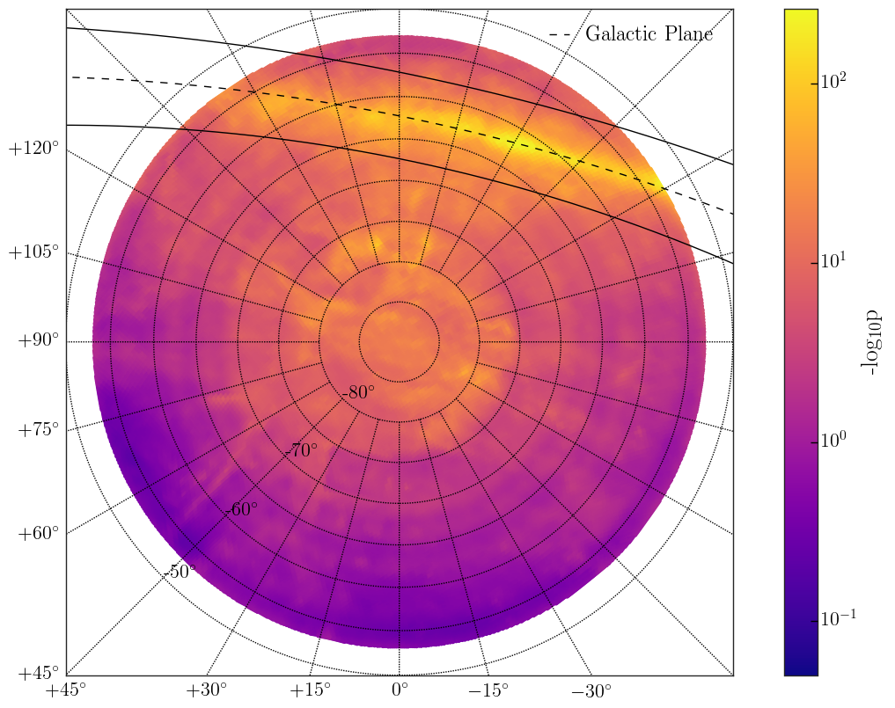
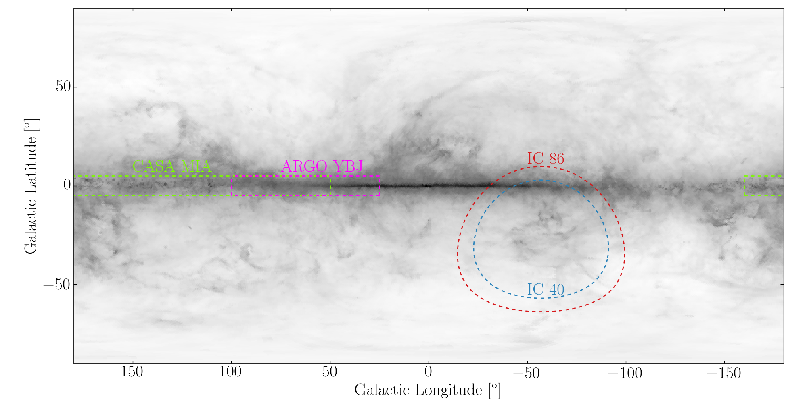
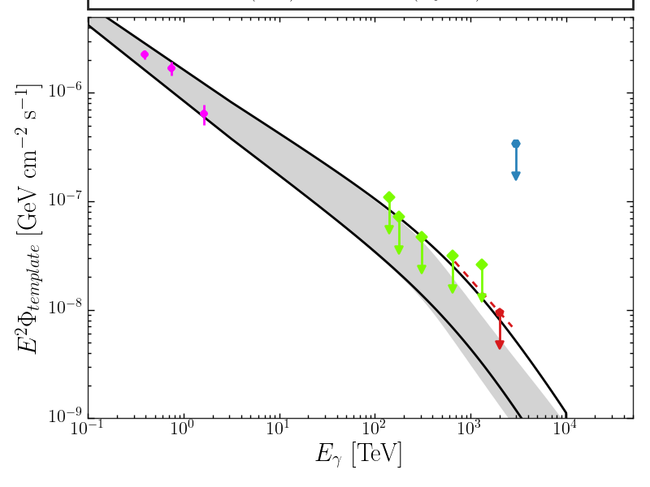

.. _galactic_plane:

**************
Galactic Plane
**************

The following scripts reproduce the section of the analysis which searches for diffuse emission from the galactic plane.  All scripts are within the ``pev_photons/template`` directory.

---------------------
Template Construction
---------------------

To construct the template objects for each year of data, run:

.. code-block:: bash

    python template_builder.py --year all

This creates a structured numpy array ``{prefix}/template/{year}/fermi_pi0_exp.npy`` with all the fields required by the template method.

To plot the Fermi :math:`\pi^0` template convolved with detector acceptance (Figure 12 in the paper), execute:

.. code-block:: bash

    python plot_template_x_acc.py

   **Figure 12**:  The Fermi-LAT :math:`\pi^0` decay spatial template multiplied by the detector acceptance for the data year 2012. 

-----------------
Template Analysis
-----------------

To run the likelihood test with the Fermi :math:`\pi^0` template, execute:

.. code-block:: bash

    python run_gp_analysis.py

This creates the structured numpy array ``{prefix}/template/fermi_pi0_fit_result.npy``, which includes the test statistic and :math:`n_s` values from the fit.

To produce a background trial test statistic ensemble, **on submitter**, run:

.. code-block:: bash

    python cluster_bg_trials.py

The 10,000 trials produced are stored in ``{prefix}/template/trials/fermi_pi0``.  Then the p-value can be calculated via:

.. code-block:: bash

    python p_value_calc.py

This adds the p-value to the fit results file created earlier.  To skip generating your own trials, add the ``--use-original-trials`` option.  Your result should match the following table:

.. list-table:: Fermi Template Fit Result 
   :widths: auto
   :header-rows: 1

   * - Test Statistic
     - p-value 
     - :math:`n_s` 
   * - 0.22
     - 0.276
     - 150.70

-----------------------
Sensitivity Calculation
-----------------------

To determine the sensitivity to the required level of precision (~1% uncertainty), we run signal injection trials on the cluster.  First, we determine a reasonable range of injection points with:

.. code-block:: bash

    python sensitivity_test.py

Which runs 100 trials per injection point.  This step can be ommitted if you simply wish to compare final results.  Next, we run 10,000 trials at each injection points on the cluster.  **On submitter**, execute:

.. code-block:: bash

    python cluster_sens_trials.py

Finally, perform a :math:`\chi^2` fit on the fraction of trials above 0 as a function of the number of injected events with:

.. code-block:: bash

    python sens_fit.py

This yields the :math:`n_s` value which corresponds to a fraction of trials above 0 at 0.90 with 1% precision and calculates the corresponding flux.  The output (stored at ``{prefix}/template/fermi_pi0_sens.npy``, should match the following table:

.. list-table:: Fermi Template Sensitivity Result
   :widths: auto
   :header-rows: 1

   * - :math:`n_s` 
     - :math:`n_s` error
     - Flux [:math:`GeV^{−1}cm^{-2}s^{-1}`]
     - Flux error
   * - 491.2
     - 2.3
     - 2.63e-22
     - 1.23e-24

-----
Plots
-----

To produce a plot with ARGO-YBJ, CASA-MIA, IC-40, and IC-86 fields-of-view overlaid on the Fermi :math:`\pi^0` skymap (figure 13(left) in the paper), run:

.. code-block:: bash

    python plot_fov.py

   **Figure 13 (left)**:  The respective field of views of CASA-MIA, ARGO-YBJ, IC-40, and this analysis overlaid on a map of the :math:`\pi^0` decay component of the Fermi-LAT galactic plane diffuse emission model.

To produce the plot comparing upper limits on the normalization of the Fermi pi0 decay emission model (figure 13(right) in the paper), run:

.. code-block:: bash

    python plot_galactic_limit.py --fermi_limit

   **Figure 13 (right)**:  The IceCube 90% confidence level upper limit on the flux from the :math:`\pi^0` decay component of the Fermi-LAT galactic plane diffuse emission model in our field of view as compared to results from ARGO-YBJ, CASA-MIA, and IC-40. Dotted lines show the E :math:`^{-3.0}` spectrum, used for obtaining IceCube upper limits, over the energy range containing 5% to 95% events in the final sample. Also shown are unattenuated and attenuated flux predictions from Vernetto 2017. 
