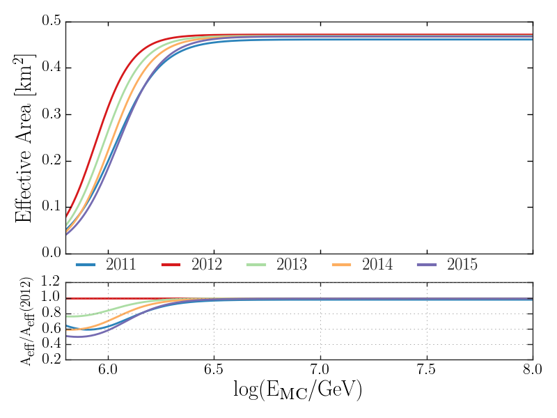
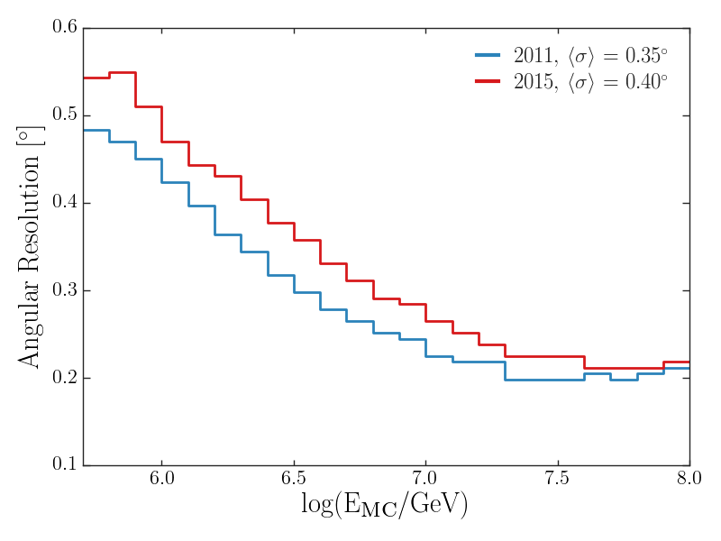
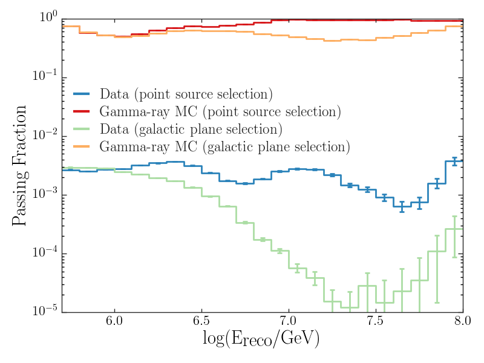

.. _performance_checks:

******************
Performance Checks
******************

The following scripts reproduce the plots in the paper which related to reconstruction and event selection performance.  All scripts are within the ``pev-photons/performance_checks`` directory.

--------------
Effective Area
--------------

The effective area to gamma rays a function of true energy for all dataset years is illustrated by running:

.. code-block:: bash

    python eff_area_comp.py --sigmoid --noBins

   **Figure 2**:  IceTop's effective area to gamma rays simulated with snow heights from each year of the data-taking period of the analysis. All cuts listed in Section \ref{sec:qc} were applied. In 2011 a pre-scaling factor of three was applied for events where the shower triggered less than eight stations which produces the lower effective area relative to the amount of snow.

------------------
Angular Resolution
------------------

To plot the angular resolution for gamma rays as a function of true energy for the 2011 and 2015 analysis years weighted to an :math:`E^{-2.0}` spectrum, run:

.. code-block:: bash

    python ang_res.py

   **Figure 3**:  Angular resolution to gamma rays from simulation using detector response with snow heights from the first and last year of the data-taking period of the analysis.

------------------
Angular Resolution
------------------

To plot the fraction of quality-cut level events that survive the gamma-hadron separation cut, run:

.. code-block:: bash

    python passing_fraction.py

   **Figure 6**:  Fraction of events at the quality cut level which pass the gamma-hadron discrimination cut for gamma ray simulation and data as a function of energy.  Both the point source and Galactic plane component event selections are shown. 
